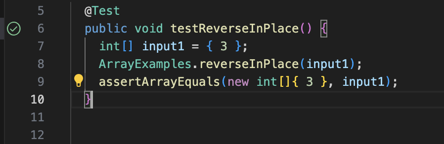
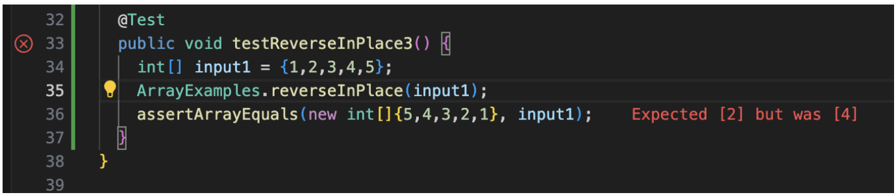

# Part 1
The bug I chose is in the method `ReverseInPlace`
1. A failure-inducing input
   ```
   @Test 
	public void testReverseInPlace3() {
    int[] input1 = {1,2,3,4,5};
    ArrayExamples.reverseInPlace(input1);
    assertArrayEquals(new int[]{5,4,3,2,1}, input1);
   }
   ```
2. An input that doesn't induce a failure
   ```
   @Test 
	public void testReverseInPlace() {
    int[] input1 = { 3 };
    ArrayExamples.reverseInPlace(input1);
    assertArrayEquals(new int[]{ 3 }, input1);
   }
   ```
3. The symptom of the two tests above
   
   
4. Code before-and-after
   Code before:
   ```
   static void reverseInPlace(int[] arr) {
    for(int i = 0; i < arr.length; i += 1) {
      arr[i] = arr[arr.length - i - 1];
    }
  }
  ```
   Code after:
   ```
   static void reverseInPlace(int[] arr) {
    int[] newArray1 = new int[arr.length];
    for(int i = 0; i < arr.length; i += 1) {
      newArray1[i] = arr[i];
    }
    for(int i = 0; i < arr.length; i += 1) {
      arr[i] = newArray1[newArray1.length - i - 1];
    }
  } 
  ```
5. The issue with the old code is that the copy process changes the `arr` itself when reversing it. In my new code, I first make a copy of `arr` and reverse it using its original elements.

# Part 2
## Command Less
1. `-N` displays line numbers at the beginning of each line
  * Example 1:
    ```
    
  
