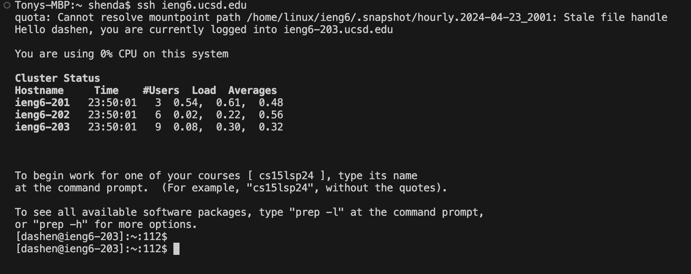
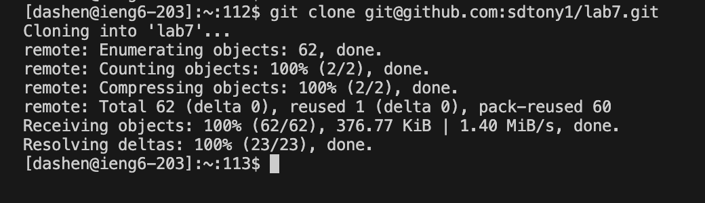
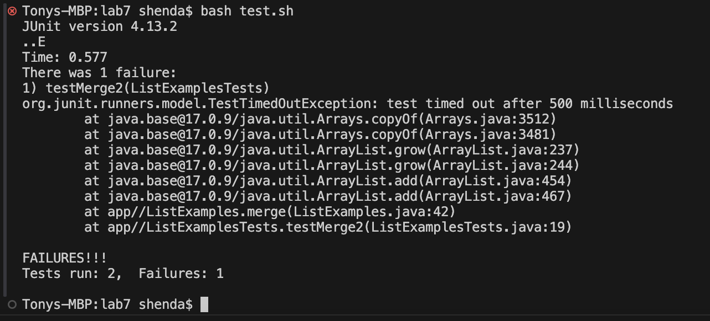
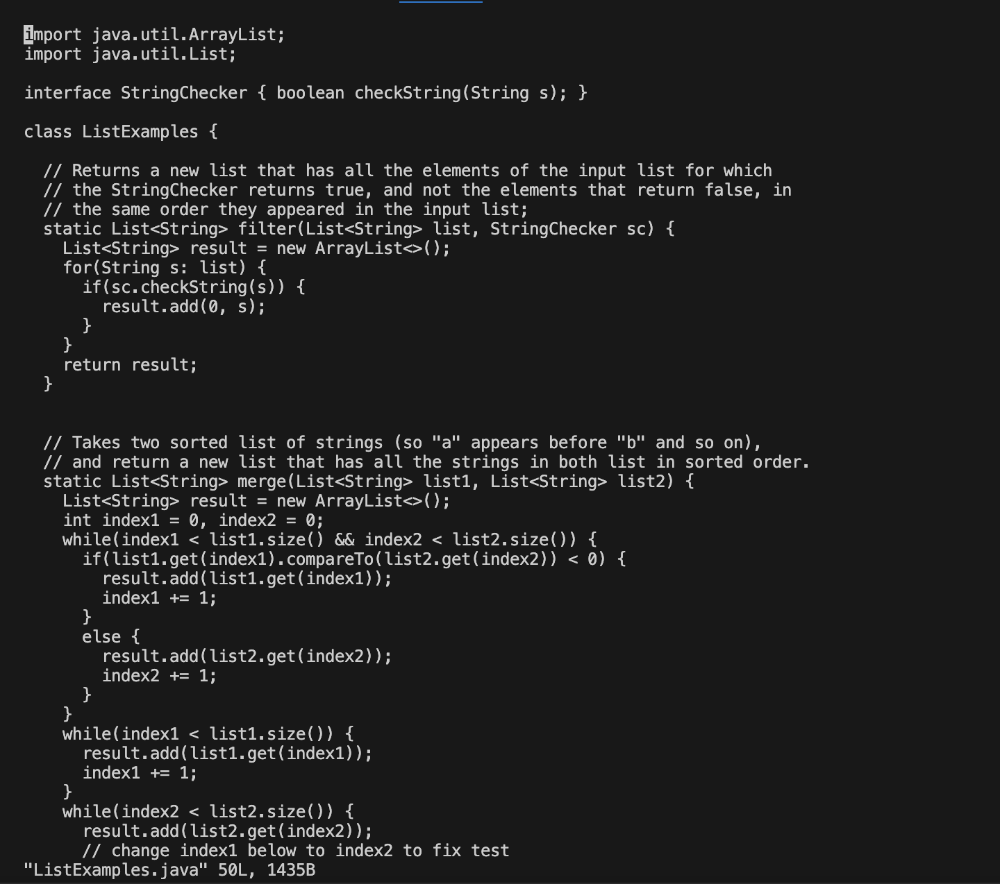
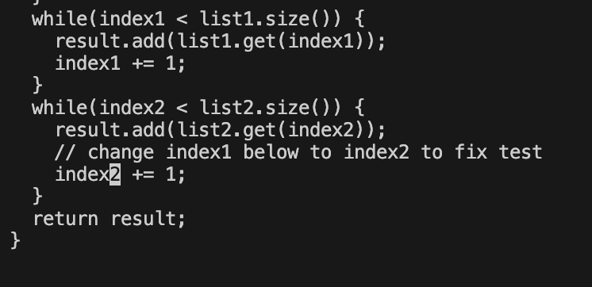
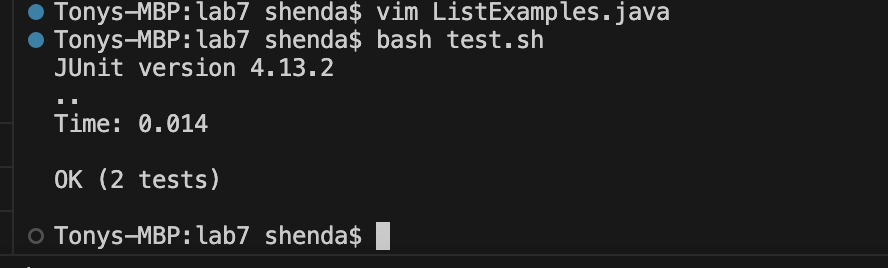
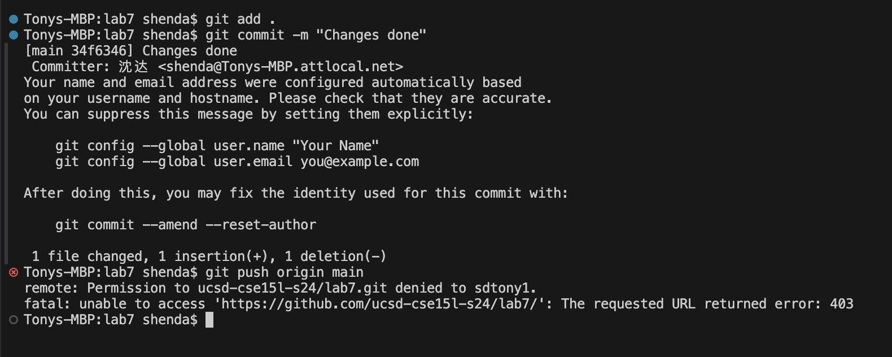

# Step 4

Command pressed: `ssh ieng6.ucsd.edu`
This command helps me log into ieng6 machine.

# Step 5

Command pressed: `git clone git@github.com:sdtony1/lab7.git`
This command clones the fork of the repository.

# Step 6

Command pressed: `bash test.sh`
This command runs the tests.

# Step 7

Command pressed: `vim ListExamples.java`
Keys pressed: `<:42> <enter> <j> <j> <l> <l> <l> <l> <l> <x> <i> <2> <esc> <:wq> <enter>`
The command `vim ListExamples.java` initializes `vim`.
Command `<:42>` helps me navigate to line 42.
Command `<j>` and `<l>` moves the cursor.
Command `<:wq>` saves and exits `vim`

# Step 8

Command pressed: `bash test.sh`
This command runs the tests again.

# Step 9

Command pressed: `git add .` `git commit -m "Changes done"` `git push origin main`
This command commits and pushes the resulting changes to my Github account.
