# Part 1
1. Original post from the student, a guess of the bug, and failure-inducing input
   Student's code
   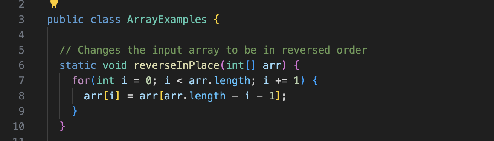 
   I also checked the student's file structure.                  
   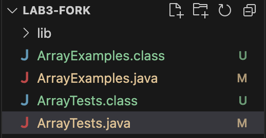
   The file structure is correct.
   Student's test case                                              
   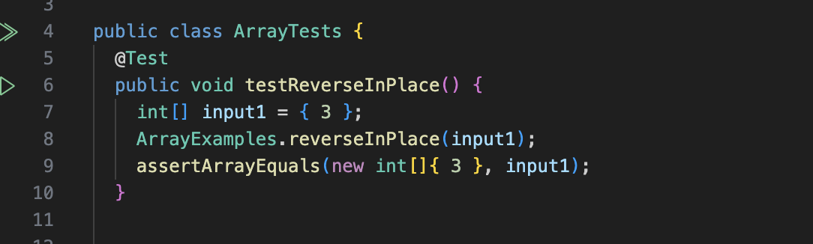
   Student's test case symptom
   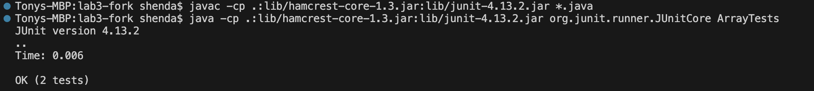
   Though this student's code has no failure under his own test case, the method `reverseInPlace` does not look correct because of the modification of `arr` inside the for loop.
   So here's my guess of the bug and my failure-inducing input.
   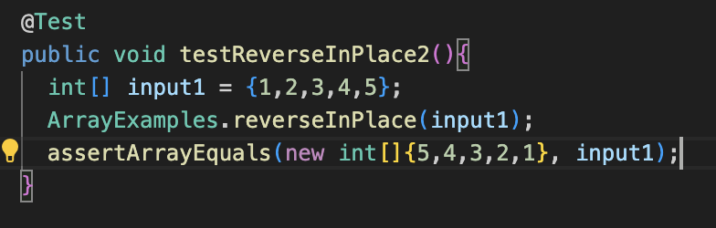

3. My response according to the output of my failure-inducing test.
   Output of my failure-inducing test
   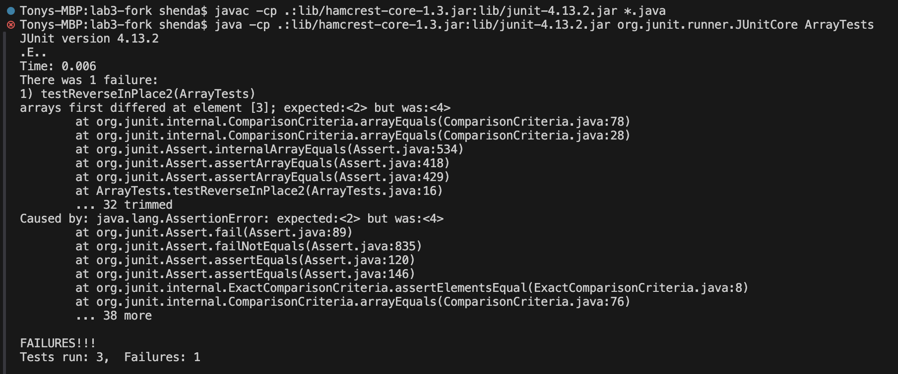
   My response:
   `Your file structure is correct. There is something wrong with your reverseInPlace method. Your test case is not sufficient enough. Try to add more tests and think about more scenarios.`

4. Student's behavior
   After receiving the response, the student adds more test cases to test his `reverseInPlace` method.
   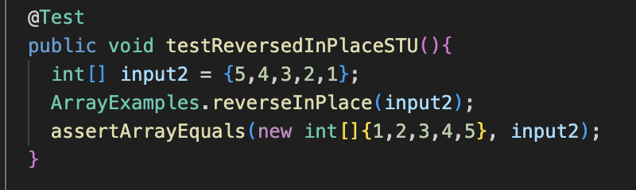
   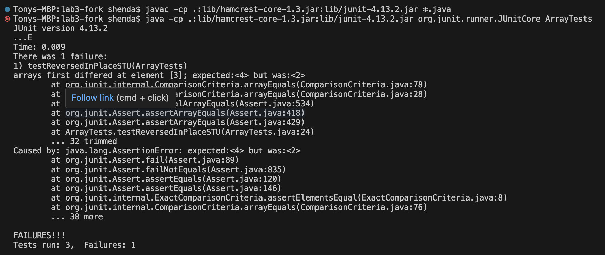
   After detecting the failure, the student checks his codes and finds the bug. The method overwrites elements of the array in the first half of the loop, which means it doesn't 
   correctly swap elements from the start and end of the array.
   After knowing the error, the student modifies his codes by adding a separate parameter to store the length. 
   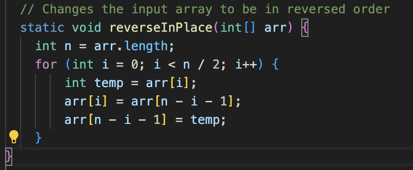
   His modified codes pass his own test.
   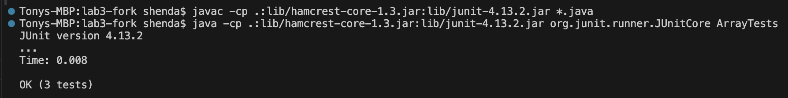
   Then the student resubmitted his codes to canvas.

5. I test it using my own test case.
   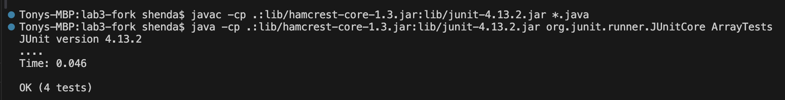
   The student's codes pass my test.
   My response:
   `Congratulation your codes passed the test cases. Your score is 100%!`

# Part 2
I find labs to be very meaningful. In lectures, I learn new concepts and operating methods from the professor. In labs, I have the chance to impliment them in real cases. I learned how to use Vim and JDB to debug. I learned the process of Autograder. Overrall, labs help me better understand and master the key points taught in classes. 
