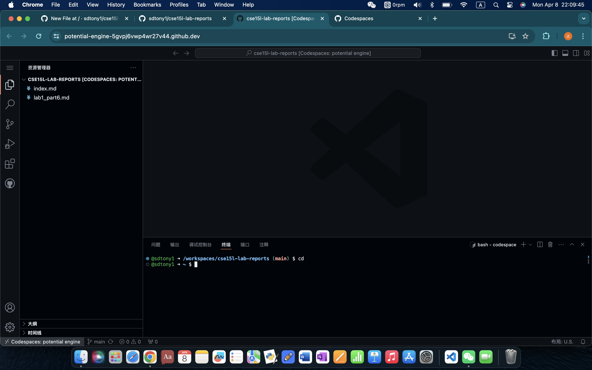

# Examples of command `cd`
1. no argument
   * 
   * /workspaces/cse15l-lab-reports
   * The command outputs nothing because `cd` doesn't do its job. No target directory is inputed.
   * It's not an error.
2. with a path to a directory
   * 
   * /workspaces
   * The command changes the directory to cse15l-lab-reports under workspaces.
   * The output is not an error.
3. with a path to a file
   * 
   * /workspaces/cse15l-lab-reports
   * `cd` can't change working directory to a file, so it got error.
   * The output is an error. `cd` can't change working directory to a file.
  
# Examples of command `ls`
1. no argument
   * 
   * /workspaces/cse15l-lab-reports
   * The command lists the files in the current path
   * The output is not an error.
2. with a path to a directory
   * 
   * /workspaces/
   * The command lists the files in the targeted path.
   * The output is not an error.
3. with a path to a file
   * ![Image]（ls with path to a file.png）
   * /workspaces/
   * The command gives out the current path because ls can only list files in a given path.
   * the output is not an error.

# Examples of command `cat`
1. no argument
   * 
   * /workspaces/cse15l-lab-reports/
   * The command outputs nothing.
   * THe output is an error because `cat` must include the path in its arguments.
2. with a path to a directory
   * ![Image] (cat with path to directory.png)
   * /workspaces/cse15l-lab-reports/
   * The command causes an error because the input argument is a directory
   * The output is an error because `cat` can't print contents of a directory
3. with a path to a file
   * 
   * /workspaces/cse15l-lab-reports/
   * The command outputs contents in the file
   * The output is not an error. 

