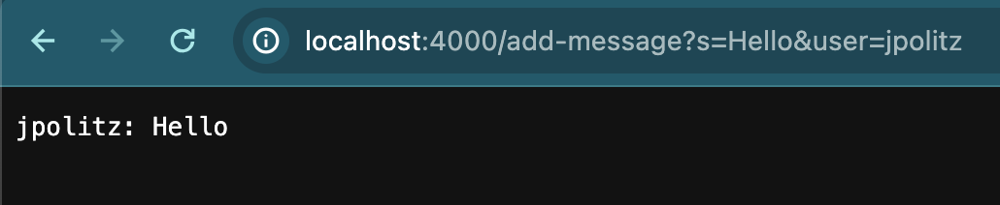
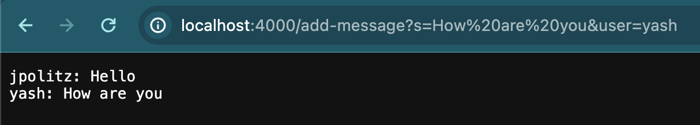
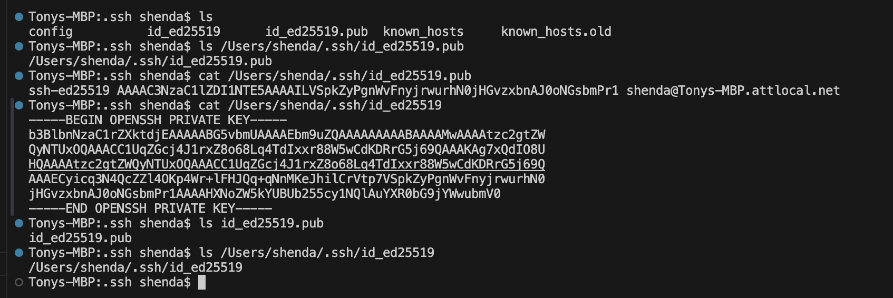
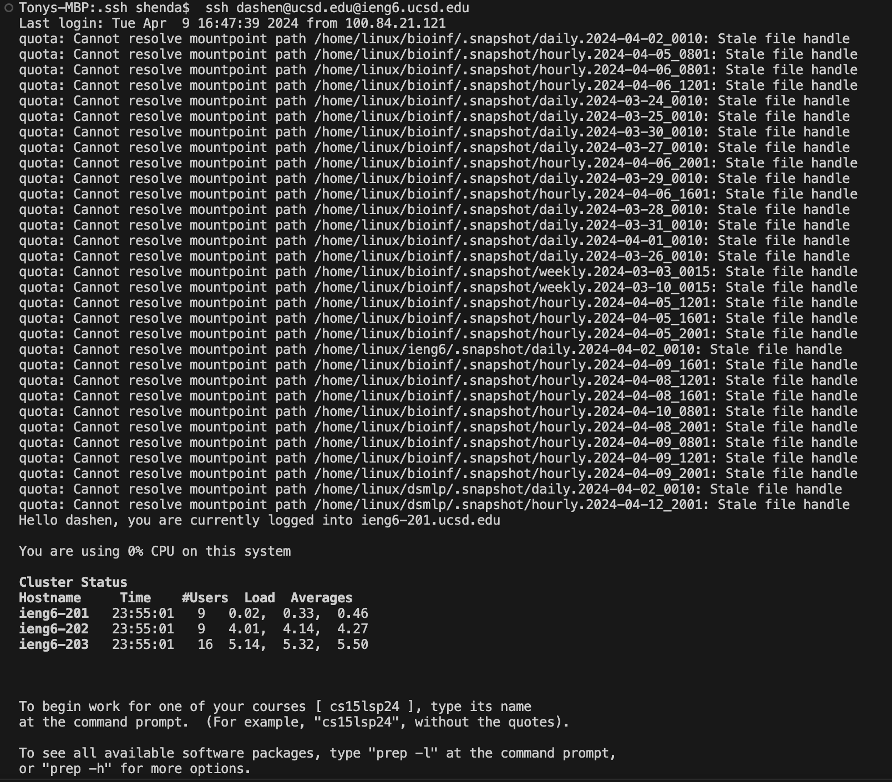

# Code for ChatServer:
import java.io.IOException;
import java.net.URI;

class Handler implements URLHandler {
    String result = "";
    
    public String handleRequest(URI url) {
        String[] parameters = url.getQuery().split("&");
        String[] front = parameters[0].split("=");
        String[] back = parameters[1].split("=");
        String input = back[1] +": "+ front[1]+ "\n";
        result += input;
        return result;
    }
}
class ChatServer {
    public static void main(String[] args) throws IOException {
        if(args.length == 0){
            System.out.println("Missing port number! Try any number between 1024 to 49151");
            return;
        }
        int port = Integer.parseInt(args[0]);
        Server.start(port, new Handler());
    }
}

# Screenshots of using `/add-message`
1. 
* The `handleRequest` method in my code is called here.
* argument is `url` in my method. It equals to `http://localhost:4000/add-message?s=Hello&user=jpolitz` here.
* Field `result` changes to `jpolitz: Hello`

2. 
*  The `handleRequest` method is called here.
*  Argument is `url` in my method. It equals to `http://localhost:4000/add-message?s=How%20are%20you&user=yash` here.
*  Field `result` changes to `jpolitz: Hello + \n + ash: How are you` here.

# Part 2
1. 
2. ![Image]
3. 
